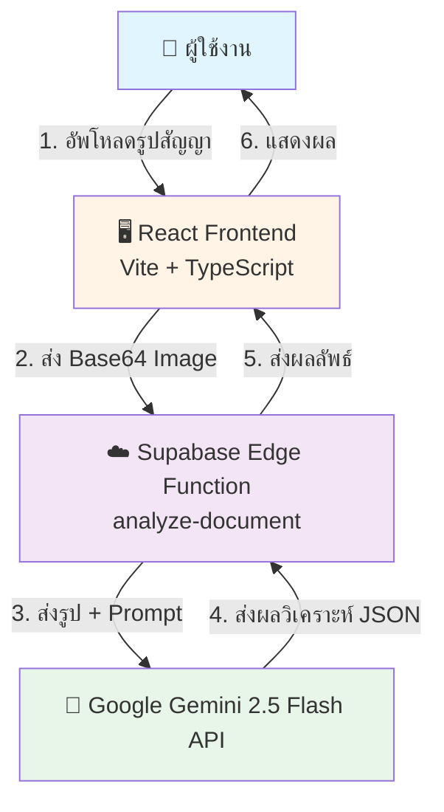
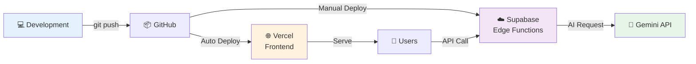

# 📋 ขั้นตอนและ Data Flow ของระบบ Sanya Sabai Legal Aid

## 🎯 ภาพรวมระบบ

**Sanya Sabai Legal Aid** เป็นระบบช่วยเหลือทางกฎหมายที่ใช้ AI (Google Gemini 2.5 Flash) ในการวิเคราะห์เอกสารสัญญาและประเมินความเสี่ยงทางกฎหมาย โดยมีเป้าหมายเพื่อช่วยให้ประชาชนทั่วไปเข้าใจสัญญาที่ตนเองกำลังจะลงนามได้ง่ายขึ้น

---

## 🏗️ สถาปัตยกรรมระบบ (Architecture)



### เทคโนโลยีที่ใช้

| ส่วนประกอบ | เทคโนโลยี |
|-----------|----------|
| **Frontend** | React 18 + TypeScript + Vite |
| **UI Framework** | Radix UI + Tailwind CSS + shadcn/ui |
| **Routing** | React Router DOM v6 |
| **State Management** | React Hooks + TanStack Query |
| **Backend** | Supabase Edge Functions (Deno Runtime) |
| **AI Model** | Google Gemini 2.5 Flash |
| **Deployment** | Vercel (Frontend) + Supabase (Backend) |

---

## 📊 Data Flow แบบละเอียด

### 🔄 Flow Diagram แบบเต็ม

```mermaid
sequenceDiagram
    participant U as 👤 ผู้ใช้
    participant B as 🌐 Browser
    participant R as ⚛️ React App
    participant S as ☁️ Supabase Function
    participant G as 🤖 Gemini API

    U->>B: 1. เปิดหน้า /demo
    B->>R: โหลด Demo.tsx
    
    U->>B: 2. อัพโหลดรูปสัญญา
    B->>R: handleFile(file)
    R->>R: FileReader.readAsDataURL()
    R->>R: setImagePreview(base64)
    R->>R: setStep("preview")
    
    U->>B: 3. กดปุ่ม "เริ่มวิเคราะห์ด้วย AI"
    B->>R: analyzeDocument()
    R->>R: setStep("analyzing")
    
    R->>S: supabase.functions.invoke("analyze-document")<br/>{imageBase64: "data:image/jpeg;base64,..."}
    
    S->>S: แยก base64 data
    S->>S: สร้าง prompt ภาษาไทย
    S->>S: เตรียม parts array
    
    S->>G: POST /v1beta/models/gemini-2.5-flash:generateContent<br/>Content-Type: application/json<br/>Body: {contents, generationConfig}
    
    G->>G: อ่านข้อความจากรูป (OCR)
    G->>G: วิเคราะห์เงื่อนไขสัญญา
    G->>G: ตรวจสอบกฎหมายไทย
    G->>G: ประเมินความเสี่ยง
    G->>G: สร้าง JSON response
    
    G->>S: Response 200 OK<br/>{candidates: [{content: {parts: [{text: "{...}"}]}}]}
    
    S->>S: แยก text จาก response
    S->>S: JSON.parse(content)
    S->>S: Validate structure
    
    S->>R: {success: true, analysis: {...}}
    
    R->>R: setAnalysisResult(data.analysis)
    R->>R: setStep("result")
    R->>B: แสดงผลวิเคราะห์
    B->>U: 4. เห็นผลการวิเคราะห์
```

---

## 🎬 ขั้นตอนการทำงานแบบละเอียด

### **ขั้นตอนที่ 1: การอัพโหลดเอกสาร** 📤

**ไฟล์:** [`Demo.tsx`](file:///c:/Users/paiwo/OneDrive/Desktop/sanya-sabai-legal-aid/src/pages/Demo.tsx)

#### 1.1 ผู้ใช้เลือกวิธีอัพโหลด
- **ถ่ายรูป**: ใช้กล้องถ่ายรูปเอกสารโดยตรง (Mobile)
- **อัพโหลดไฟล์**: เลือกไฟล์จากเครื่อง (Desktop/Mobile)
- **Drag & Drop**: ลากไฟล์มาวางในพื้นที่

```typescript
// รองรับ 3 วิธี
<input type="file" accept="image/*" capture="environment" /> // ถ่ายรูป
<input type="file" accept="image/*,.pdf" />                  // อัพโหลด
<div onDrop={handleDrop} />                                  // Drag & Drop
```

#### 1.2 อ่านไฟล์เป็น Base64
```typescript
const handleFile = (file: File) => {
  setUploadedFile(file);
  
  const reader = new FileReader();
  reader.onload = (e) => {
    // แปลงเป็น data URL (base64)
    setImagePreview(e.target?.result as string);
    // ไปหน้า preview
    setStep("preview");
  };
  reader.readAsDataURL(file);
};
```

**Output:** 
```
data:image/jpeg;base64,/9j/4AAQSkZJRgABAQAAAQABAAD/2wBDA...
```

---

### **ขั้นตอนที่ 2: แสดงตัวอย่างและยืนยัน** 👁️

#### 2.1 แสดงรูปภาพที่อัพโหลด
```tsx

```

#### 2.2 ผู้ใช้ตรวจสอบและกดปุ่ม
- **เลือกรูปใหม่**: `resetDemo()` - ล้างข้อมูลและเริ่มใหม่
- **เริ่มวิเคราะห์ด้วย AI**: `analyzeDocument()` - ส่งไปวิเคราะห์

---

### **ขั้นตอนที่ 3: ส่งข้อมูลไป Supabase Edge Function** ☁️

**ไฟล์:** [`Demo.tsx`](file:///c:/Users/paiwo/OneDrive/Desktop/sanya-sabai-legal-aid/src/pages/Demo.tsx#L73-L112)

#### 3.1 เรียก Supabase Function
```typescript
const { data, error } = await supabase.functions.invoke("analyze-document", {
  body: { imageBase64: imagePreview }
});
```

**Request Body:**
```json
{
  "imageBase64": "data:image/jpeg;base64,/9j/4AAQSkZJRgABAQAAAQABAAD..."
}
```

#### 3.2 Supabase Client Configuration
```typescript
// ใช้ environment variables
VITE_SUPABASE_URL=https://your-project.supabase.co
VITE_SUPABASE_ANON_KEY=eyJhbGciOiJIUzI1NiIsInR5cCI6IkpXVCJ9...
```

---

### **ขั้นตอนที่ 4: Edge Function ประมวลผล** ⚙️

**ไฟล์:** [`index.ts`](file:///c:/Users/paiwo/OneDrive/Desktop/sanya-sabai-legal-aid/supabase/functions/analyze-document/index.ts)

#### 4.1 รับ Request และตรวจสอบ CORS
```typescript
serve(async (req) => {
  // Handle CORS preflight
  if (req.method === "OPTIONS") {
    return new Response(null, { headers: corsHeaders });
  }
  
  // Parse request body
  const { imageBase64, textContent } = await req.json();
```

#### 4.2 ตรวจสอบ API Key
```typescript
const GEMINI_API_KEY = Deno.env.get("GEMINI_API_KEY");
if (!GEMINI_API_KEY) {
  throw new Error("GEMINI_API_KEY is not configured");
}
```

#### 4.3 สร้าง System Prompt (ภาษาไทย)
```typescript
const systemPrompt = `คุณเป็นผู้เชี่ยวชาญด้านกฎหมายและการเงินของไทย...

เมื่อได้รับเอกสาร ให้วิเคราะห์และตอบกลับเป็น JSON ที่มีโครงสร้างดังนี้:
{
  "documentType": "ประเภทเอกสาร เช่น สัญญาเงินกู้, สัญญาเช่าซื้อ",
  "riskScore": 0-100,
  "summary": "สรุปใจความสำคัญ",
  "risks": [...],
  "recommendations": [...]
}

กฎหมายไทยที่ควรพิจารณา:
- อัตราดอกเบี้ยสูงสุด: 15% ต่อปี
- ห้ามเรียกดอกเบี้ยทบต้น
- สัญญาที่ไม่เป็นธรรมอาจถูกศาลสั่งให้เป็นโมฆะได้
`;
```

#### 4.4 เตรียมข้อมูลสำหรับ Gemini API
```typescript
let parts: any[] = [];

// เพิ่ม system prompt
parts.push({
  text: systemPrompt + "\n\n**สำคัญมาก:** กรุณาตอบกลับเป็น JSON object เท่านั้น"
});

// เพิ่มรูปภาพ (ถ้ามี)
if (imageBase64) {
  const base64Data = imageBase64.split("base64,")[1]; // ตัด prefix
  
  parts.push({
    inline_data: {
      mime_type: "image/jpeg",
      data: base64Data
    }
  });
}

const contents = [{
  role: "user",
  parts: parts
}];
```

---

### **ขั้นตอนที่ 5: เรียก Gemini API** 🤖

**ไฟล์:** [`index.ts`](file:///c:/Users/paiwo/OneDrive/Desktop/sanya-sabai-legal-aid/supabase/functions/analyze-document/index.ts#L86-L100)

#### 5.1 ส่ง Request ไป Gemini
```typescript
const response = await fetch(
  `https://generativelanguage.googleapis.com/v1beta/models/gemini-2.5-flash:generateContent?key=${GEMINI_API_KEY}`,
  {
    method: "POST",
    headers: { "Content-Type": "application/json" },
    body: JSON.stringify({
      contents: contents,
      generationConfig: {
        temperature: 0.3,        // ความสร้างสรรค์ต่ำ (เน้นความแม่นยำ)
        responseMimeType: "application/json"  // บังคับให้ตอบเป็น JSON
      }
    })
  }
);
```

**Request Structure:**
```json
{
  "contents": [
    {
      "role": "user",
      "parts": [
        {
          "text": "คุณเป็นผู้เชี่ยวชาญด้านกฎหมาย..."
        },
        {
          "inline_data": {
            "mime_type": "image/jpeg",
            "data": "/9j/4AAQSkZJRg..."
          }
        }
      ]
    }
  ],
  "generationConfig": {
    "temperature": 0.3,
    "responseMimeType": "application/json"
  }
}
```

#### 5.2 Gemini ประมวลผล
1. **OCR (Optical Character Recognition)**: อ่านข้อความจากรูปภาพ
2. **Text Analysis**: วิเคราะห์เนื้อหาสัญญา
3. **Legal Check**: ตรวจสอบกฎหมายไทยที่เกี่ยวข้อง
4. **Risk Assessment**: ประเมินความเสี่ยง 0-100
5. **Generate JSON**: สร้างผลลัพธ์เป็น JSON

---

### **ขั้นตอนที่ 6: รับและประมวลผล Response** 📥

**ไฟล์:** [`index.ts`](file:///c:/Users/paiwo/OneDrive/Desktop/sanya-sabai-legal-aid/supabase/functions/analyze-document/index.ts#L130-L191)

#### 6.1 ตรวจสอบ HTTP Status
```typescript
if (!response.ok) {
  // 429: Rate limit
  if (response.status === 429) {
    return new Response(
      JSON.stringify({ error: "ระบบมีผู้ใช้งานมาก กรุณารอสักครู่" }),
      { status: 429 }
    );
  }
  
  // 402/403: API Key ผิด
  if (response.status === 402 || response.status === 403) {
    return new Response(
      JSON.stringify({ error: "API Key ไม่ถูกต้อง" }),
      { status: 402 }
    );
  }
  
  // 404: Model ไม่พร้อม
  if (response.status === 404) {
    return new Response(
      JSON.stringify({ error: "Model ไม่พร้อมใช้งาน" }),
      { status: 404 }
    );
  }
}
```

#### 6.2 แยก JSON จาก Response
```typescript
const data = await response.json();

// Gemini Response Structure:
// {
//   "candidates": [
//     {
//       "content": {
//         "parts": [
//           {
//             "text": "{\"documentType\":\"สัญญาเงินกู้\",...}"
//           }
//         ]
//       }
//     }
//   ]
// }

const content = data.candidates?.[0]?.content?.parts?.[0]?.text;
```

#### 6.3 Parse JSON (มี Fallback)
```typescript
let analysisResult;
try {
  // พยายาม parse ตรงๆ
  analysisResult = JSON.parse(content);
  console.log("✅ Successfully parsed JSON response");
} catch (parseError) {
  // ทำความสะอาดก่อน parse
  let cleanContent = content;
  cleanContent = cleanContent.replace(/```json\s*/gi, '');
  cleanContent = cleanContent.replace(/```\s*/g, '');
  cleanContent = cleanContent.trim();
  
  try {
    analysisResult = JSON.parse(cleanContent);
  } catch (e) {
    // ใช้ regex หา JSON object
    const jsonMatch = cleanContent.match(/\{[\s\S]*\}/);
    if (jsonMatch) {
      analysisResult = JSON.parse(jsonMatch[0]);
    } else {
      // Fallback response
      analysisResult = {
        documentType: "เอกสารทั่วไป",
        riskScore: 50,
        summary: content.slice(0, 200),
        risks: [],
        recommendations: ["กรุณาปรึกษาผู้เชี่ยวชาญเพิ่มเติม"]
      };
    }
  }
}
```

#### 6.4 ส่งผลลัพธ์กลับ
```typescript
return new Response(
  JSON.stringify({ success: true, analysis: analysisResult }),
  { headers: { ...corsHeaders, "Content-Type": "application/json" } }
);
```

---

### **ขั้นตอนที่ 7: แสดงผลลัพธ์** 🎨

**ไฟล์:** [`Demo.tsx`](file:///c:/Users/paiwo/OneDrive/Desktop/sanya-sabai-legal-aid/src/pages/Demo.tsx#L342-L463)

#### 7.1 รับ Response และ Update State
```typescript
if (data?.analysis) {
  console.log("✅ Analysis successful:", data.analysis);
  setAnalysisResult(data.analysis);
  setStep("result");
  toast.success("วิเคราะห์เสร็จสิ้น!");
}
```

#### 7.2 แสดงผลแบบแบ่งส่วน

**ส่วนที่ 1: Header + Risk Score**
```tsx
<div className="p-6 md:p-8 border-b border-border">
  <h2>ผลการวิเคราะห์</h2>
  <p>ประเภทเอกสาร: {analysisResult.documentType}</p>
  
  <div className={getScoreColor(analysisResult.riskScore)}>
    {analysisResult.riskScore}/100
  </div>
  <p>{getScoreLabel(analysisResult.riskScore)}</p>
</div>
```

**ส่วนที่ 2: สรุปใจความสำคัญ**
```tsx
<div className="p-6 md:p-8 bg-muted/30">
  <h3>สรุปใจความสำคัญ</h3>
  <p>{analysisResult.summary}</p>
</div>
```

**ส่วนที่ 3: รายละเอียดความเสี่ยง**
```tsx
{analysisResult.risks.map((risk, index) => {
  const colors = getRiskColor(risk.level); // high/medium/low
  return (
    <div className={`${colors.bg} border ${colors.border}`}>
      <AlertTriangle className={colors.text} />
      <div>
        <span>{risk.title}</span>
        <span className={colors.badge}>{getRiskLabel(risk.level)}</span>
        <p>{risk.description}</p>
        {risk.clause && <p>"{risk.clause}"</p>}
      </div>
    </div>
  );
})}
```

**ส่วนที่ 4: คำแนะนำ**
```tsx
{analysisResult.recommendations.map((rec, index) => (
  <li>
    <CheckCircle className="text-success" />
    <span>{rec}</span>
  </li>
))}
```

**ส่วนที่ 5: Action Buttons**
```tsx
<Button>โทรหาสายด่วนทนาย</Button>
<Button>ดาวน์โหลดรายงาน</Button>
<Button>แชร์เตือนชุมชน</Button>
```

---

## 📋 โครงสร้างข้อมูล (Data Structures)

### Input Data (Frontend → Backend)

```typescript
interface UploadRequest {
  imageBase64?: string;  // "data:image/jpeg;base64,..."
  textContent?: string;  // (สำหรับอนาคต)
}
```

### Analysis Result (Backend → Frontend)

```typescript
interface AnalysisData {
  documentType: string;        // "สัญญาเงินกู้", "สัญญาเช่าซื้อ"
  riskScore: number;           // 0-100
  summary: string;             // สรุปภาษาชาวบ้าน
  risks: RiskItem[];           // รายการความเสี่ยง
  recommendations?: string[];  // คำแนะนำ
}

interface RiskItem {
  level: "high" | "medium" | "low";
  title: string;               // "ดอกเบี้ยสูงเกินกฎหมาย"
  description: string;         // คำอธิบายภาษาชาวบ้าน
  clause?: string;             // ข้อความในสัญญา (ถ้ามี)
}
```

### ตัวอย่าง Response จริง

```json
{
  "success": true,
  "analysis": {
    "documentType": "สัญญาเงินกู้",
    "riskScore": 75,
    "summary": "เป็นสัญญากู้เงินจำนวน 50,000 บาท ดอกเบี้ย 3% ต่อเดือน ซึ่งสูงกว่ากฎหมายกำหนด และมีเงื่อนไขการยึดทรัพย์สินที่เข้มงวด",
    "risks": [
      {
        "level": "high",
        "title": "ดอกเบี้ยสูงเกินกฎหมาย",
        "description": "ดอกเบี้ย 3% ต่อเดือน (36% ต่อปี) สูงกว่าที่กฎหมายกำหนดไว้ที่ 15% ต่อปี",
        "clause": "ผู้กู้ตกลงชำระดอกเบี้ยในอัตรา 3% ต่อเดือน"
      },
      {
        "level": "medium",
        "title": "เงื่อนไขการยึดทรัพย์สิน",
        "description": "หากผิดนัดชำระ 1 งวด ผู้ให้กู้มีสิทธิยึดทรัพย์สินทันที",
        "clause": "หากผู้กู้ผิดนัดชำระหนี้ ผู้ให้กู้มีสิทธิยึดทรัพย์ที่จำนองไว้ทันที"
      }
    ],
    "recommendations": [
      "ปรึกษาทนายก่อนลงนาม",
      "เจรจาลดอัตราดอกเบี้ยให้ต่ำกว่า 15% ต่อปี",
      "ขอเพิ่มระยะเวลาผ่อนผันก่อนยึดทรัพย์"
    ]
  }
}
```

---

## 🎨 UI/UX Flow

### Progress Steps

```
[1. อัพโหลด] → [2. ตรวจสอบ] → [3. วิเคราะห์] → [4. ผลลัพธ์]
    ↓              ↓               ↓               ↓
  upload        preview       analyzing         result
```

### State Management

```typescript
const [step, setStep] = useState<"upload" | "preview" | "analyzing" | "result">("upload");
const [uploadedFile, setUploadedFile] = useState<File | null>(null);
const [imagePreview, setImagePreview] = useState<string | null>(null);
const [analysisResult, setAnalysisResult] = useState<AnalysisData | null>(null);
```

### Color Coding (Risk Levels)

| Risk Level | สี | Badge | ความหมาย |
|-----------|---|-------|---------|
| **high** | 🔴 Red | `bg-destructive` | เสี่ยงสูง |
| **medium** | 🟡 Yellow | `bg-warning` | ควรระวัง |
| **low** | 🟢 Green | `bg-success` | ปกติ |

### Risk Score Ranges

| คะแนน | สี | ป้ายกำกับ |
|------|---|----------|
| 70-100 | 🔴 Red | ความเสี่ยงสูง |
| 40-69 | 🟡 Yellow | ควรระวัง |
| 0-39 | 🟢 Green | ความเสี่ยงต่ำ |

---

## 🔐 Environment Variables

### Frontend (.env)
```bash
VITE_SUPABASE_URL=https://your-project.supabase.co
VITE_SUPABASE_ANON_KEY=eyJhbGciOiJIUzI1NiIsInR5cCI6IkpXVCJ9...
```

### Backend (Supabase Secrets)
```bash
GEMINI_API_KEY=AIzaSy...
```

---

## 🚀 Deployment Flow



### Deploy Commands

**Frontend (Vercel):**
```bash
npm run build
# Auto-deploy via Vercel GitHub integration
```

**Backend (Supabase):**
```bash
supabase functions deploy analyze-document
```

---

## 🛡️ Error Handling

### Frontend Error Handling
```typescript
try {
  const { data, error } = await supabase.functions.invoke("analyze-document", {
    body: { imageBase64: imagePreview }
  });
  
  if (error) throw error;
  if (data?.error) throw new Error(data.error);
  
  // Success
  setAnalysisResult(data.analysis);
  toast.success("วิเคราะห์เสร็จสิ้น!");
} catch (error) {
  toast.error(error.message || "เกิดข้อผิดพลาด");
  setStep("preview"); // กลับไปหน้าเดิม
}
```

### Backend Error Handling
```typescript
// HTTP Status Codes
429 → "ระบบมีผู้ใช้งานมาก กรุณารอสักครู่"
402/403 → "API Key ไม่ถูกต้อง"
404 → "Model ไม่พร้อมใช้งาน"
500 → "เกิดข้อผิดพลาดในการวิเคราะห์"
```

---

## 📱 Responsive Design

### Breakpoints
```css
sm: 640px   /* Mobile landscape */
md: 768px   /* Tablet */
lg: 1024px  /* Desktop */
```

### Mobile-First Approach
```tsx
<div className="flex flex-col sm:flex-row gap-4">
  {/* Stack vertically on mobile, horizontal on desktop */}
</div>
```

---

## 🎯 Key Features

### 1. **Multi-Input Support**
- 📸 Camera capture (mobile)
- 📁 File upload
- 🖱️ Drag & drop

### 2. **Real-time Progress**
- ✅ Step indicator
- ⏳ Loading animation
- 📊 Progress feedback

### 3. **Comprehensive Analysis**
- 📄 Document type detection
- 📊 Risk scoring (0-100)
- ⚠️ Risk categorization (high/medium/low)
- 💡 Actionable recommendations

### 4. **User-Friendly Output**
- 🎨 Color-coded risks
- 📝 Plain Thai language
- 📋 Structured layout
- 🔍 Clause highlighting

---

## 🔄 Complete Request/Response Example

### Request
```http
POST https://your-project.supabase.co/functions/v1/analyze-document
Content-Type: application/json
Authorization: Bearer YOUR_ANON_KEY

{
  "imageBase64": "data:image/jpeg;base64,/9j/4AAQSkZJRg..."
}
```

### Response
```json
{
  "success": true,
  "analysis": {
    "documentType": "สัญญาเงินกู้",
    "riskScore": 75,
    "summary": "เป็นสัญญากู้เงินจำนวน 50,000 บาท...",
    "risks": [
      {
        "level": "high",
        "title": "ดอกเบี้ยสูงเกินกฎหมาย",
        "description": "ดอกเบี้ย 3% ต่อเดือน...",
        "clause": "ผู้กู้ตกลงชำระดอกเบี้ย..."
      }
    ],
    "recommendations": [
      "ปรึกษาทนายก่อนลงนาม",
      "เจรจาลดอัตราดอกเบี้ย"
    ]
  }
}
```

---

## 📚 สรุป

ระบบ **Sanya Sabai Legal Aid** ทำงานผ่าน **7 ขั้นตอนหลัก**:

1. ✅ **อัพโหลดเอกสาร** - ผู้ใช้เลือกรูปสัญญา
2. ✅ **แสดงตัวอย่าง** - ตรวจสอบรูปก่อนส่ง
3. ✅ **ส่งไป Edge Function** - Supabase รับ Base64
4. ✅ **ประมวลผล** - เตรียม Prompt + Image
5. ✅ **เรียก Gemini API** - AI วิเคราะห์เอกสาร
6. ✅ **รับผลลัพธ์** - Parse JSON + Validate
7. ✅ **แสดงผล** - UI แสดงผลแบบสวยงาม

**เทคโนโลยีหลัก:**
- 🎨 Frontend: React + TypeScript + Tailwind
- ☁️ Backend: Supabase Edge Functions (Deno)
- 🤖 AI: Google Gemini 2.5 Flash
- 🚀 Deployment: Vercel + Supabase

**จุดเด่น:**
- ✨ ใช้งานง่าย (3 คลิก)
- 🇹🇭 ภาษาไทยทั้งระบบ
- ⚡ รวดเร็ว (< 10 วินาที)
- 🎯 แม่นยำ (AI Model ล่าสุด)
- 📱 Responsive (ใช้ได้ทุกอุปกรณ์)
